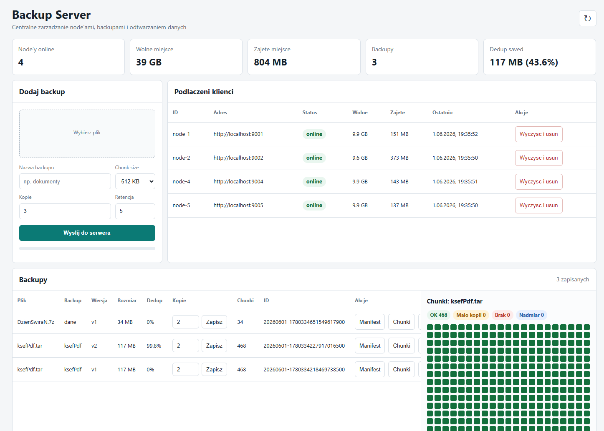

# Prosiak

Prosiak is a distributed backup prototype written in Go. It stores deduplicated chunks across multiple storage nodes and keeps backup metadata on a central server.

Prosiak to prosty system backupu rozproszonego. Serwer dzieli dane na chunki, zapisuje je na wielu node'ach, pilnuje liczby kopii, trzyma metadane w SQLite i pozwala odtworzyc konkretna wersje backupu.

Pomysl jest taki, zeby wiele zwyklych maszyn moglo dzialac jak jedna pula storage. Przy wiekszej liczbie node'ow serwer rozklada dane po dostepnych komputerach, dorabia brakujace kopie, usuwa nadmiarowe kopie i sprzata chunki, ktore nie sa juz potrzebne.



## Co Potrafi

- backup pojedynczych plikow przez CLI albo panel web,
- backup calych katalogow z configu JSON,
- wykluczenia typu `.git`, `node_modules`, `*.log`,
- wersjonowanie backupow pod jedna logiczna nazwa,
- retencje, czyli trzymanie tylko ostatnich `N` wersji,
- deduplikacje chunkow,
- content-defined chunking, dzieki czemu mala zmiana w katalogu nie przesuwa calego backupu,
- replikacje chunkow na wielu node'ach,
- automatyczne dorabianie brakujacych kopii po awarii node'a,
- automatyczne sprzatanie osieroconych chunkow po powrocie offline node'a,
- prosty panel web do podgladu node'ow, backupow i mapy chunkow.

## Architektura

```text
backupctl / browser
        |
        v
centralny serwer Prosiaka
- API backup/restore
- panel web
- SQLite z metadanymi
- wybor node'ow
- scheduler replikacji i sprzatania
        |
        v
node'y storage
- zapis chunkow
- odczyt chunkow
- usuwanie chunkow
```

Node'y sa celowo proste. Nie znaja nazw plikow, katalogow, uzytkownikow ani manifestow. Dostaja tylko chunki i trzymaja je na dysku.

## Szybki Start

Wejdz do katalogu projektu:

```powershell
cd C:\path\to\Prosiak
```

Uruchom serwer:

```powershell
go run ./cmd/backup-server -config configs\server.json
```

Przy starcie program wypisze nazwe i wersje, np. `Prosiak 1.0 backup-server starting`.

Panel web bedzie dostepny tutaj:

```text
http://localhost:8080/
```

Uruchom pierwszy node:

```powershell
go run ./cmd/backup-node -config configs\node.json
```

Jesli chcesz uruchomic kolejne node'y na tej samej maszynie, nadpisz parametry z linii komend:

```powershell
go run ./cmd/backup-node -config configs\node.json -id node-2 -addr :9002 -public-addr http://localhost:9002 -storage storage-node-2
```

```powershell
go run ./cmd/backup-node -config configs\node.json -id node-3 -addr :9003 -public-addr http://localhost:9003 -storage storage-node-3
```

## Backup Katalogu

Przykladowy config klienta jest w `configs/client.json`:

```json
{
  "server": "http://localhost:8080",
  "chunk_size": 262144,
  "replication": 3,
  "retention": 5,
  "jobs": [
    {
      "name": "documents",
      "paths": [
        "C:/path/to/documents"
      ],
      "exclude": [
        "**/.git/**",
        "**/node_modules/**",
        "**/bin/**",
        "**/obj/**",
        "**/*.tmp",
        "**/*.log"
      ]
    }
  ]
}
```

Jesli config ma jeden job, wystarczy:

```powershell
go run ./cmd/backupctl backup-job -config configs\client.json
```

Jesli config ma kilka jobow, wybierz konkretny:

```powershell
go run ./cmd/backupctl backup-job -config configs\client.json -job documents
```

`backupctl` skanuje katalogi rekurencyjnie, pomija wpisy z `exclude`, pakuje wynik do strumienia `tar` bez kompresji i wysyla go do serwera. Brak kompresji jest celowy: dzieki temu deduplikacja ma wieksza szanse ponownie uzyc chunkow z poprzednich wersji.

Podczas backupu `backupctl` pokazuje postep na stderr. Dla pojedynczego pliku widac bajty i procent, a dla backupu katalogu widac liczbe bajtow wyslanych w strumieniu `.tar`.

## Lista Backupow

Zeby zobaczyc backupy, wersje i `file_id`:

```powershell
go run ./cmd/backupctl list -server http://localhost:8080
```

Wynik pokazuje m.in.:

```text
BACKUP   VERSION   FILE_ID   SIZE   DEDUP   CREATED_AT   NAME
```

Do restore wybierasz konkretne `FILE_ID`, czyli konkretna wersje backupu.

## Restore Katalogu

```powershell
go run ./cmd/backupctl restore-job -server http://localhost:8080 -id <file_id> -out C:\restore\documents
```

`restore-job` pobiera backup z serwera i rozpakowuje archiwum `tar` do wskazanego katalogu.

## Backup I Restore Pojedynczego Pliku

Backup pliku:

```powershell
go run ./cmd/backupctl backup -server http://localhost:8080 -file .\dane.zip -name dokumenty -retention 5 -chunk-size 262144 -replication 2
```

Restore pliku:

```powershell
go run ./cmd/backupctl restore -server http://localhost:8080 -id <file_id> -out .\restore.zip
```

## Wersje I Retencja

Ten sam backup mozesz wrzucac wiele razy pod jedna logiczna nazwa, np. `documents`.

Serwer nadaje kolejne wersje:

```text
documents v1
documents v2
documents v3
```

Parametr `retention` mowi, ile ostatnich wersji zostawic. Przyklad:

```json
"retention": 5
```

oznacza: trzymaj ostatnie 5 wersji, starsze usuwaj automatycznie. Wartosc `0` wylacza automatyczne kasowanie starych wersji.

Usuniecie starej wersji nie kasuje chunkow uzywanych przez nowsze wersje. Chunks sa usuwane dopiero wtedy, gdy nie nalezy do nich juz zaden backup.

## Chunk Size

`chunk_size` jest docelowym srednim rozmiarem chunka. Serwer uzywa content-defined chunking, wiec granice chunkow wynikaja z tresci, a nie ze sztywnego ciecia co dokladnie `N` bajtow.

Przykladowe wartosci:

```text
32 KB  = 32768
64 KB  = 65536
128 KB = 131072
256 KB = 262144
512 KB = 524288
1 MB   = 1048576
4 MB   = 4194304
16 MB  = 16777216
64 MB  = 67108864
```

Mniejsze chunki zwykle pomagaja deduplikacji, ale zwiekszaja liczbe wpisow i operacji. Wieksze chunki sa prostsze i czesto szybsze, ale moga gorzej lapac male zmiany. Sensowny start to `262144` albo `524288`.

## Replikacja I Awarie Node'ow

Kazdy backup ma ustawiona liczbe kopii chunkow:

```json
"replication": 3
```

Przy replikacji `3` serwer stara sie trzymac kazdy chunk na trzech roznych node'ach.

Node wysyla heartbeat mniej wiecej co 15 sekund. Jesli serwer nie widzi node'a przez okolo 45 sekund, traktuje go jako offline.

Scheduler serwera dziala w tle:

- dorabia brakujace kopie, gdy aktywnych kopii jest za malo,
- usuwa nadmiarowe kopie, gdy stary node wroci i kopii jest za duzo,
- usuwa osierocone chunki po backupach skasowanych wtedy, gdy node byl offline,
- czeka, jesli nie ma zadnej aktywnej kopii danego chunka.

Domyslny interwal schedulera ustawisz w `configs/server.json`:

```json
"replication_interval": "30s"
```

## Configi

Serwer:

```powershell
go run ./cmd/backup-server -config configs\server.json
```

Node:

```powershell
go run ./cmd/backup-node -config configs\node.json
```

Klient backupu katalogow:

```powershell
go run ./cmd/backupctl backup-job -config configs\client.json
```

Flagi z linii komend nadpisuja wartosci z configu. Przyklad:

```powershell
go run ./cmd/backup-node -config configs\node.json -capacity 50GB
```

Prywatne configi trzymaj jako `*.local.json`, np.:

```text
configs/home.local.json
```

Takie pliki sa ignorowane przez Git.

## Linux

Prosiak moze dzialac pod Linuxem. Projekt jest napisany w Go i uzywa przenosnych mechanizmow: HTTP, plikow/katalogow oraz SQLite przez `modernc.org/sqlite`.

Build natywnie na Linuxie:

```bash
go build -o backup-server ./cmd/backup-server
go build -o backup-node ./cmd/backup-node
go build -o backupctl ./cmd/backupctl
```

Uruchomienie:

```bash
./backup-server -config configs/server.json
./backup-node -config configs/node.json
./backupctl list -server http://localhost:8080
```

W configach zmien sciezki Windowsowe typu `C:/path/to/documents` na linuxowe, np.:

```json
"paths": [
  "/home/user/documents"
]
```

Jesli budujesz binarki linuxowe z Windowsa:

```powershell
$env:GOOS="linux"
$env:GOARCH="amd64"
$env:CGO_ENABLED="0"
go build -o backup-server-linux-amd64 ./cmd/backup-server
go build -o backup-node-linux-amd64 ./cmd/backup-node
go build -o backupctl-linux-amd64 ./cmd/backupctl
```

Na maszynach produkcyjnych pamietaj o otwarciu portow miedzy serwerem i node'ami oraz o ustawieniu `public_addr` na adres widoczny z serwera.

## HTTPS / TLS

Domyslnie Prosiak nadal startuje po zwyklym HTTP, zeby lokalny quick start dzialal bez certyfikatow. Szyfrowanie polaczen wlaczasz przez podanie certyfikatu i klucza dla procesu, ktory nasluchuje:

```json
{
  "addr": ":8443",
  "cert_file": "certs/server.crt",
  "key_file": "certs/server.key",
  "ca_cert_file": "certs/ca.crt"
}
```

Dla node'a ustaw jednoczesnie HTTPS w adresie publicznym i adresie serwera:

```json
{
  "addr": ":9443",
  "public_addr": "https://localhost:9443",
  "server": "https://localhost:8443",
  "cert_file": "certs/node.crt",
  "key_file": "certs/node.key",
  "ca_cert_file": "certs/ca.crt"
}
```

`ca_cert_file` mowi klientowi HTTP, jaki CA ma zaufac. Uzywaja go:

- `backupctl`, gdy laczy sie z serwerem,
- node, gdy rejestruje sie w serwerze,
- serwer, gdy zapisuje, odczytuje i usuwa chunki na node'ach.

Do lokalnych testow z self-signed certem mozesz uzyc `-insecure-skip-verify` albo `"insecure_skip_verify": true`, ale nie traktuj tego jako bezpiecznego ustawienia produkcyjnego.

### Generowanie Certyfikatow Do Testow

Najwygodniej zrobic lokalne CA i podpisac nim certyfikat serwera oraz node'a. W PowerShellu, z katalogu projektu:

```powershell
mkdir certs
```

Lokalne CA:

```powershell
openssl req -x509 -newkey rsa:4096 -nodes `
  -keyout certs\ca.key `
  -out certs\ca.crt `
  -days 3650 `
  -subj "/CN=Prosiak Local CA"
```

Certyfikat serwera dla `localhost`:

```powershell
openssl req -newkey rsa:2048 -nodes `
  -keyout certs\server.key `
  -out certs\server.csr `
  -subj "/CN=localhost"
```

Utworz plik `certs\localhost.ext`:

```text
subjectAltName=DNS:localhost,IP:127.0.0.1
```

i podpisz certyfikat tak:

```powershell
openssl x509 -req `
  -in certs\server.csr `
  -CA certs\ca.crt `
  -CAkey certs\ca.key `
  -CAcreateserial `
  -out certs\server.crt `
  -days 825 `
  -sha256 `
  -extfile certs\localhost.ext
```

Certyfikat node'a lokalnego:

```powershell
openssl req -newkey rsa:2048 -nodes `
  -keyout certs\node.key `
  -out certs\node.csr `
  -subj "/CN=localhost"

openssl x509 -req `
  -in certs\node.csr `
  -CA certs\ca.crt `
  -CAkey certs\ca.key `
  -CAcreateserial `
  -out certs\node.crt `
  -days 825 `
  -sha256 `
  -extfile certs\localhost.ext
```

Po tym ustaw `ca_cert_file` na `certs/ca.crt`, a `cert_file` i `key_file` odpowiednio na certyfikat danego procesu.

## Panel Web

Panel web pozwala:

- zobaczyc podlaczone node'y,
- sprawdzic wolne i zajete miejsce,
- wyslac plik do backupu,
- wybrac chunk size i liczbe kopii,
- zobaczyc liste backupow,
- podejrzec manifest,
- sprawdzic dostepnosc chunkow,
- zmienic replikacje istniejacego backupu,
- pobrac backup,
- usunac backup.

Kolory mapy chunkow:

- zielony: jest wystarczajaco aktywnych kopii,
- zolty: jest mniej aktywnych kopii niz wymagano,
- czerwony: nie ma aktywnej kopii,
- niebieski: aktywnych kopii jest wiecej niz wymagano.

## API

Serwer:

```text
GET    /nodes
DELETE /nodes/{id}
GET    /files
POST   /backups?chunk_size=524288&replication=3
GET    /files/{id}/manifest
GET    /files/{id}/availability
PATCH  /files/{id}/replication
GET    /files/{id}/download
DELETE /files/{id}
GET    /chunks/{hash}/locations
```

Node:

```text
PUT    /chunks/{hash}
GET    /chunks/{hash}
DELETE /chunks/{hash}
DELETE /storage?confirm=delete-all-chunks
GET    /health
```

## Dane I Bezpieczenstwo

Metadane serwera sa w SQLite:

```text
server-data/backup.db
```

Node'y trzymaja fizyczne chunki w katalogach typu:

```text
storage-node-1/
storage-node-2/
storage-node-3/
```

Polaczenia moga byc szyfrowane przez HTTPS/TLS po ustawieniu `cert_file`, `key_file` i zaufanego `ca_cert_file`.

Na ten moment chunki na dysku node'a nie sa szyfrowane. To znaczy, ze osoba z dostepem do dysku node'a moze odczytac fragmenty danych. Nie wystawiaj tego systemu bezposrednio do internetu i traktuj go jako prototyp/MVP.

## Ograniczenia

- brak szyfrowania chunkow na dysku,
- brak autoryzacji,
- brak pelnego trybu HA dla metadanych serwera,
- SQLite `backup.db` jest pojedynczym punktem metadanych,
- scheduler jest prosty i wymaga dalszego utwardzenia przed produkcja.

## Licencja

MIT
